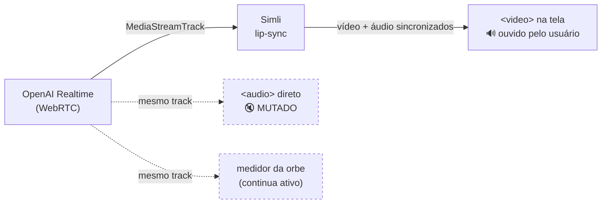

# Avatar com lip-sync na conversa por voz (Simli)

> **Status:** implementado e no repositório — **inativo até as credenciais existirem**.
> Sem `SIMLI_API_KEY`, a chamada cai sozinha na orbe e continua funcionando por voz.
> **Stack:** OpenAI Realtime API (WebRTC) + Simli (`simli-client@3.0.2`) + Supabase Edge Functions.
> **Data:** 2026-08-12.

O modo de voz da Hunters.IO deixa de mostrar uma esfera abstrata e passa a mostrar **o
rosto dela falando**, com a boca sincronizada ao áudio real da conversa.

---

## 1. O que muda no caminho do áudio

Antes, o áudio nascia na Realtime API e ia direto para o alto-falante. Agora ele dá uma
volta: o Simli recebe esse áudio e devolve **vídeo e áudio já sincronizados**, e é esse
par que o profissional vê e ouve.



### A regra que não pode ser quebrada

O mesmo track alimenta **três** consumidores. Dois são inofensivos; um mata a feature:

> **Quando o avatar sobe, o `<audio>` direto TEM que ser mutado.**
> Os dois tocando juntos fazem o profissional ouvir cada frase **duas vezes**, com o
> atraso do processamento entre elas. É o sintoma número um a procurar num teste.

O medidor da orbe (`medirStream`) continua ligado no track o tempo todo, de propósito:
é ele que anima a tela enquanto o avatar sobe, e é o que sobra se o avatar não subir.

---

## 2. Peças

| Arquivo | Papel |
|---|---|
| `supabase/functions/simli-token/index.ts` | Troca a API key por um session token de vida curta. **A chave nunca vai para o browser.** |
| `src/hooks/useSimliAvatar.ts` | Todo o ciclo de vida do Simli: token, conexão, `ClearBuffer`, encerramento. |
| `src/components/CopilotDrawer.tsx` | Liga o track no avatar, muta o áudio direto, troca a orbe pelo `<video>`. |
| `src/lib/speak.ts` | `AVATAR_HABILITADO` — a chave de desligar. |
| `src/components/VoiceOrb.tsx` | **Não mudou.** Virou o estado de carregamento e o fallback. |

### O hook

```ts
const avatar = useSimliAvatar();
// { status, videoRef, audioRef, motivo, iniciar, interromper, parar }

await avatar.iniciar(track);  // sobe a sessão e passa a alimentá-la
avatar.interromper();         // ClearBuffer — cala o avatar na hora
avatar.parar();               // fecha a sessão (e para a cobrança)
```

`iniciar()` devolve `false` em **qualquer** falha — token recusado, `startup_error`,
timeout de 20 s. Quem chama usa isso para decidir se muta o áudio direto ou não. Nada
aqui é obrigatório para a conversa acontecer.

---

## 3. Interrupção

A sessão roda com `semantic_vad` + `interrupt_response`: quando o profissional fala por
cima, a OpenAI **para de gerar** — mas o áudio que já saiu está na fila do Simli.

Sem tratamento, o avatar terminaria a frase sozinho, falando por cima de quem o
interrompeu. Por isso o evento `input_audio_buffer.speech_started` dispara
`avatar.interromper()`, que envia um `SKIP` para o Simli.

---

## 4. Configuração

### Secrets no Supabase

| Secret | Obrigatório | Padrão | Para quê |
|---|---|---|---|
| `SIMLI_API_KEY` | sim | — | Autenticação. Só existe no servidor. |
| `SIMLI_FACE_ID` | sim | — | O rosto. Trocar o avatar é trocar este secret — **sem deploy do front**. |
| `SIMLI_MAX_SESSION` | não | `1800` (30 min) | Teto por sessão. Freio de custo. |
| `SIMLI_MAX_IDLE` | não | `180` (3 min) | Corta sessão ociosa. Freio de custo. |
| `SIMLI_MODEL` | não | escolha do Simli | `fasttalk` ou `artalk`. |

### Passos, na ordem

1. **Criar o rosto a partir de `public/hunters-io.jpg`** — começa por aqui: o
   processamento leva **algumas horas**. Enquanto isso, dá para desenvolver com um dos
   rostos padrão do Simli.
2. Gravar `SIMLI_API_KEY` e `SIMLI_FACE_ID` nos secrets do Supabase.
3. `supabase functions deploy simli-token`.

### Desligar

`AVATAR_HABILITADO = false` em `src/lib/speak.ts`. O código do Simli nem é acionado e a
chamada volta inteira ao comportamento anterior — orbe e áudio direto.

---

## 5. Duas armadilhas do pacote `simli-client`

Ambas já estão resolvidas no código; ficam registradas porque voltariam numa atualização
descuidada da dependência.

**1. Import quebra no Linux.** O `dist/index.js` publicado faz `require("./Client")`, mas
o arquivo que vem no pacote é `client.js`, em minúsculas. No Windows passa; **no build da
Vercel quebraria**. Por isso o import é pelo caminho profundo:

```ts
import type { SimliClient } from "simli-client/dist/client";
```

**2. Ele arrasta o `livekit-client` (~458 kB).** Importado estaticamente, o chunk do
`CopilotDrawer` saltava de 66 kB para 541 kB — baixado por todo mundo que abre um chat de
texto. A classe entra por `import()` dinâmico dentro de `iniciar()`, então o peso só chega
a quem realmente inicia uma chamada.

Detalhe de conexão: usamos o transporte **livekit** (o padrão), com `iceServers = null`. O
modo `p2p` exigiria servidores de ICE, que só saem com a API key em mãos — ou seja,
obrigaria a expor a chave ou a criar mais um endpoint.

---

## 6. O que isso custa

- **Latência.** A conversa inteira fica algumas centenas de ms mais lenta, porque o áudio
  passa pelo Simli antes de ser ouvido. Só dá para julgar ouvindo.
- **Dinheiro por minuto.** Pay-as-you-go na casa de ~US$0,05/min (o modelo Trinity é bem
  mais barato). Free tier de US$10 + 50 min/mês para desenvolver. **Cada sessão de voz
  queima minutos** — daí os tetos de sessão/ociosidade e a chave de desligar.
- **Um fornecedor a mais** no caminho crítico da conversa.

---

## 7. Fora de escopo, e por quê

- **O fallback por turnos** (`useVoiceTurnLoop`) continua na orbe. Lá a fala sai de um
  `<audio>` tocando mp3, não de um `MediaStreamTrack`. O `simli-client` até oferece
  `listenToAudioElement()`, mas ele captura o elemento no próprio grafo de áudio e entraria
  em conflito com o medidor da orbe, que já usa `createMediaElementSource` no mesmo
  elemento — e `createMediaElementSource` só pode ser chamado **uma vez por elemento**. É
  um caminho de emergência; não vale um segundo pipeline frágil.
- **`VoiceAssistantModal`** (ditado campo-a-campo) não foi tocado.

---

## 8. Como testar

1. Abrir a Hunters.IO como profissional → **Cadastrar por voz**.
2. **O teste que importa:** ela cumprimenta e a boca acompanha. Ouvir com atenção se a voz
   sai **uma vez só**.
3. **Interromper:** falar por cima dela no meio de uma frase — o avatar tem que parar na
   hora, não terminar a frase.
4. **Tools:** dizer "sou marinheiro de convés, moro em Niterói" e conferir que os selos
   verdes continuam pipocando e o cadastro grava.
5. **Encerrar:** a conversa transcrita reaparece e o vídeo para. Conferir no painel do
   Simli que a sessão **fechou** — sessão aberta esquecida queima saldo.
6. **Fallback:** com `AVATAR_HABILITADO = false`, e depois com a edge function devolvendo
   erro. Nos dois casos a chamada tem que cair na orbe e seguir funcionando por voz.
7. **Mobile:** iPhone e Android reais. É onde autoplay de vídeo com som quebra.

### Diagnóstico

| Sintoma | Causa provável |
|---|---|
| Voz dobrada, com eco/atraso | O `<audio>` direto não foi mutado |
| Avatar termina a frase depois de ser interrompido | `ClearBuffer()` não chegou |
| Tela fica na orbe com "avatar indisponível (…)" | Token recusado — ler o motivo no rótulo e o `console.warn("[avatar] …")` |
| Nada toca no celular | Autoplay bloqueado — o botão "Ouvir" destrava |
| Build quebra na Vercel mas passa local | Voltou o import `simli-client` sem o caminho profundo (ver §5) |

---

## 9. Estado real

O código está completo e verificado no que dá para verificar sem conta: typecheck limpo,
build passando, code splitting confirmado (drawer 66 kB, livekit em chunk separado) e o
import validado em browser real.

**O lip-sync em si nunca rodou** — não há conta nem chave. Todo o caminho feliz do Simli
(conexão, sincronia, interrupção, latência real) está **não testado** e só pode ser
validado depois do passo 1 da seção 4.

---

## Referências

- [simli-client (npm)](https://www.npmjs.com/package/simli-client)
- [Simli — JavaScript SDK](https://docs.simli.com/api-reference/javascript)
- [simliai/simli-openai-realtime](https://github.com/simliai/simli-openai-realtime)
