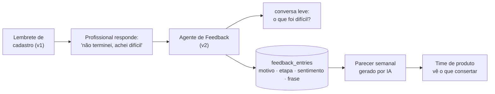
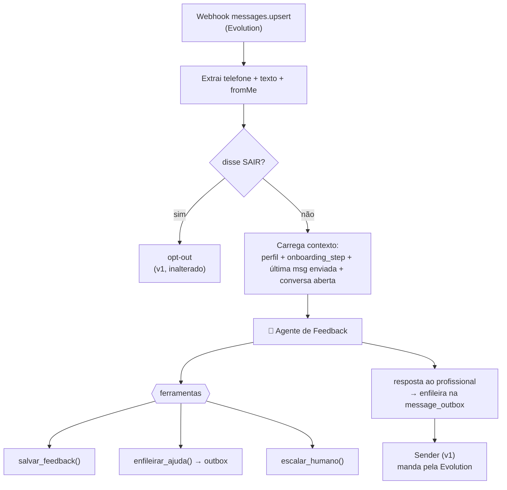
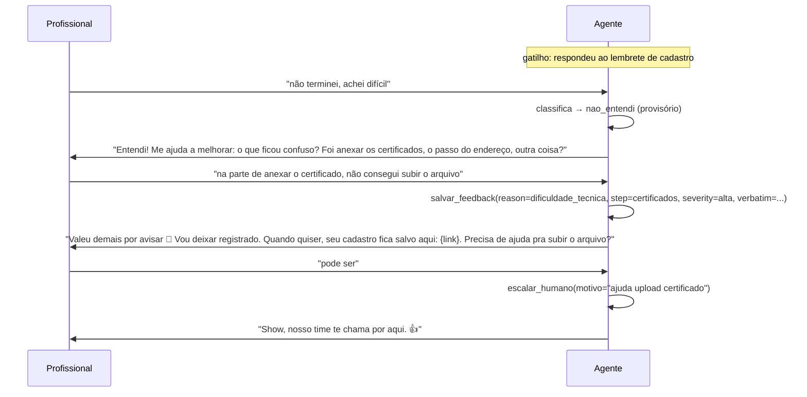
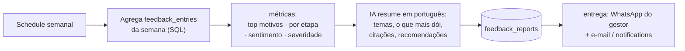
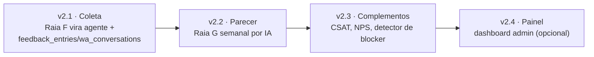

# FLUXO v2 — Inteligência de Feedback (Voz do Profissional)

Extensão da [Plataforma de Engajamento WhatsApp](FLUXO.md). Enquanto o v1 **fala** com o profissional (boas-vindas, certificados, abandono, vagas), o v2 **escuta**: quando ele responde, uma IA conduz uma conversa leve, entende *por que* ele travou no sistema, guarda isso de forma estruturada e gera um **parecer periódico** sobre como os profissionais estão vivendo a plataforma.

> Nada aqui é um sistema paralelo. Tudo roda **no mesmo workflow**, reaproveitando a fila `message_outbox`, o Sender e o webhook de entrada. O v2 só transforma o `NoOp` da Raia F (hoje um beco sem saída) num agente que coleta inteligência.

---

## 1. O problema que isto resolve

Hoje, quando alguém não conclui o cadastro, a gente sabe **que** não concluiu — nunca **por quê**. O motivo real (achou confuso? não tinha o certificado em mãos? não confiou? deu erro no upload?) fica invisível. Sem isso, o time de produto conserta no escuro.

A ideia do usuário — *"a IA vai coletando essas informações pra entendermos o lado dos profissionais e ter um parecer da utilização do sistema"* — é exatamente virar cada resposta de WhatsApp em **dado de produto**.



---

## 2. Como se encaixa no fluxo existente

O v1 já tem a **Raia F** (webhook de entrada da Evolution). Hoje ela faz: `SAIR?` → sim = opt-out, não = `NoOp`. O v2 **substitui esse `NoOp`** por um roteador + agente.



**Reuso, item por item:**

| Peça do v1 | Papel no v2 |
|---|---|
| `message_outbox` + Sender | a **resposta** da IA também vira uma mensagem enfileirada — mesmo ritmo, mesmo anti-ban |
| Webhook de entrada (Raia F) | ponto de entrada da conversa; só muda o que acontece depois do `SAIR?` |
| `message_log` | continua registrando cada troca (`inbound`/`sent`) |
| `profiles` / `onboarding_step` | contexto que a IA usa para perguntar a coisa certa |
| `whatsapp_settings` | a IA respeita opt-out e janela igual a todo o resto |

> Importante: a resposta da IA **não sai na hora** — ela entra na fila e o Sender manda. Mas como é uma conversa (o profissional está ativo na janela de 24h do WhatsApp), o feedback vai marcado com **prioridade alta** e `scheduled_for = now()`, então sai no próximo ciclo do Sender (~2 min). Rápido o bastante para parecer conversa, sem furar o modelo anti-ban.

---

## 3. O que a IA coleta (a taxonomia)

Cada conversa produz uma ou mais linhas estruturadas. O valor está em **classificar**, não só guardar o texto cru.

**Motivo de não conclusão** (`reason_code`):

| Código | Significado |
|---|---|
| `dificuldade_tecnica` | deu erro, upload falhou, travou |
| `nao_entendi` | não entendeu o que fazer / achou confuso |
| `falta_tempo` | não teve tempo, vai terminar depois |
| `falta_documento` | não tinha o CV/certificado em mãos |
| `certificado_vencido` | certificado vencido, precisa renovar antes |
| `achou_longo` | cadastro grande/trabalhoso demais |
| `desconfianca` | achou que podia ser golpe / receio de dados |
| `perdeu_interesse` | não quer mais / já se empregou |
| `outro` | não se encaixa (guarda a frase) |

Além do motivo, cada linha guarda:

- **`onboarding_step`** — em que etapa ele parou (vem do perfil; é o "onde dói")
- **`sentiment`** — `positivo` / `neutro` / `negativo` / `frustrado`
- **`verbatim`** — a frase do profissional, nas palavras dele (ouro para o parecer)
- **`severity`** — `baixa` / `media` / `alta` (bug que impede cadastro = alta)
- **`resolved`** — se a IA conseguiu ajudar na hora (mandou o link, tirou a dúvida)

---

## 4. A conversa (como a IA se comporta)

Curta e objetiva — ninguém quer responder pesquisa no WhatsApp. Regra: **no máximo 2 perguntas**, depois agradece e fecha.



Princípios do agente:
- **Uma pergunta por vez**, linguagem de gente, sem jargão.
- **Sempre fecha oferecendo ajuda** (o link do cadastro, ou passar para um humano) — coleta feedback *e* recupera o cadastro.
- **Não promete** prazos, valores ou vaga garantida.
- **Não insiste**: se a pessoa não quer falar, agradece e encerra.

---

## 5. Novas tabelas (mínimas)

```sql
-- Estado da conversa (para a IA lembrar o fio da meada entre mensagens)
CREATE TABLE public.wa_conversations (
  id            uuid PRIMARY KEY DEFAULT gen_random_uuid(),
  profile_id    uuid REFERENCES public.profiles(id) ON DELETE CASCADE,
  phone         text NOT NULL,
  topic         text NOT NULL DEFAULT 'feedback',   -- feedback | csat | nps | suporte
  status        text NOT NULL DEFAULT 'open',        -- open | closed | escalated
  turns         integer NOT NULL DEFAULT 0,          -- nº de trocas (trava conversas longas)
  history       jsonb NOT NULL DEFAULT '[]'::jsonb,  -- [{role, content}] p/ memória do agente
  last_msg_at   timestamptz NOT NULL DEFAULT now(),
  created_at    timestamptz NOT NULL DEFAULT now()
);
CREATE INDEX idx_wa_conv_phone_open ON public.wa_conversations (phone) WHERE status = 'open';

-- O dado de produto (uma linha por insight capturado)
CREATE TABLE public.feedback_entries (
  id              uuid PRIMARY KEY DEFAULT gen_random_uuid(),
  profile_id      uuid REFERENCES public.profiles(id) ON DELETE SET NULL,
  conversation_id uuid REFERENCES public.wa_conversations(id) ON DELETE SET NULL,
  source          text NOT NULL DEFAULT 'abandono',   -- abandono | csat | nps | espontaneo
  reason_code     text,                                -- ver taxonomia (seção 3)
  onboarding_step text,                                -- etapa onde travou
  sentiment       text,                                -- positivo|neutro|negativo|frustrado
  severity        text DEFAULT 'media',                -- baixa|media|alta
  score           integer,                             -- p/ CSAT(1-5) ou NPS(0-10)
  verbatim        text,                                -- a frase do profissional
  resolved        boolean DEFAULT false,
  created_at      timestamptz NOT NULL DEFAULT now()
);
CREATE INDEX idx_feedback_created ON public.feedback_entries (created_at DESC);
CREATE INDEX idx_feedback_reason  ON public.feedback_entries (reason_code);

-- O parecer gerado (histórico dos relatórios)
CREATE TABLE public.feedback_reports (
  id           uuid PRIMARY KEY DEFAULT gen_random_uuid(),
  period_start date NOT NULL,
  period_end   date NOT NULL,
  metrics      jsonb NOT NULL,     -- contagens por motivo/etapa/sentimento
  summary_md   text NOT NULL,      -- o parecer em markdown, escrito pela IA
  created_at   timestamptz NOT NULL DEFAULT now()
);
```

Todas com RLS admin-only, no mesmo padrão da Fase 0. O n8n (service_role) escreve; o painel admin lê.

---

## 6. O agente de IA (dentro do n8n)

Nó **AI Agent** do n8n, na Raia F. Modelo via o gateway que vocês já usam (`ai.gateway.lovable.dev`) ou qualquer chat model configurado como credencial.

**System prompt (resumo):**
> Você é o assistente da Hunters Manpower no WhatsApp. Seu objetivo é entender, de forma breve e gentil, por que o profissional não concluiu o cadastro e registrar isso. Faça no máximo 2 perguntas curtas. Sempre ofereça ajuda ao final (o link do cadastro ou falar com um humano). Nunca prometa vaga, salário ou prazo. Se a pessoa reclamar de algo sério, desconfiar de golpe ou pedir para falar com alguém, use `escalar_humano`. Ao entender o motivo, use `salvar_feedback` com a classificação. Encerre agradecendo.

**Ferramentas (tools) que o agente chama:**

| Ferramenta | Faz (via função SQL / node) |
|---|---|
| `salvar_feedback(reason, step, sentiment, severity, verbatim, resolved)` | INSERT em `feedback_entries` |
| `enfileirar_resposta(texto)` | `enqueue_message` com template livre, prioridade alta |
| `oferecer_link_cadastro()` | enfileira o link `/cadastro` (reaproveita convite/token quando existir) |
| `escalar_humano(motivo)` | marca conversa `escalated` + notifica o time (Slack/registro em `notifications`) |
| `encerrar_conversa()` | fecha a `wa_conversations` |

**Memória:** a coluna `wa_conversations.history` guarda o vai-e-vem; o agente recebe isso como contexto a cada mensagem nova do mesmo número.

**Guardrails:**
- Trava em `turns >= 4` (encerra educadamente) — evita loop e economiza token.
- Fora da taxonomia → `reason_code = outro` + `verbatim`.
- Reclamação/jurídico/ameaça → `escalar_humano`, nunca tenta resolver sozinho.

---

## 7. Complementos ao escopo (além do pedido)

O gancho da conversa abre espaço para coletar mais sinal, tudo pela mesma fila:

### 7.1 Micro-CSAT após concluir o cadastro
Quando `profile_complete` vira `true`, enfileira **uma** pergunta: *"De 1 a 5, como foi finalizar seu cadastro?"*. A resposta vira `feedback_entries(source='csat', score=1..5)`. Barato e mede a fricção **de quem conseguiu** (complementa quem desistiu).

### 7.2 NPS pós-embarque
Depois de um embarque (a plataforma já tem `professional_boarding_history`), pergunta o NPS clássico: *"De 0 a 10, quanto você recomendaria a Hunters a um colega?"*. Fecha o ciclo com a experiência real de trabalho, não só de cadastro.

### 7.3 Detector de blocker recorrente
Job diário: se **N profissionais** relatam o mesmo `reason_code` na mesma `onboarding_step` numa janela curta (ex.: 5 em 48h dizendo "não consigo anexar certificado"), dispara um **alerta ao time de produto** — isso provavelmente é um bug, não fricção individual. Vira a diferença entre "achamos que está ok" e "10 pessoas travaram no mesmo botão ontem".

### 7.4 Fechamento de loop com recuperação
Toda conversa de feedback tenta **resgatar o cadastro**: manda o link, oferece ajuda humana. Assim o módulo não só mede a evasão — **reduz** a evasão. O `resolved=true` mede quantos voltaram.

### 7.5 Painel no app (opcional, fase futura)
As tabelas já deixam pronto um dashboard admin: top motivos, mapa de calor de abandono por etapa, tendência de sentimento, citações. Mas o **parecer por IA** (abaixo) entrega 80% do valor sem front nenhum.

---

## 8. O "parecer" — relatório automático por IA

O coração do pedido: um **parecer da utilização do sistema**, gerado sozinho.

**Gatilho:** schedule semanal (ex.: segunda 08:00) — mais um trigger no mesmo workflow.

**Como é montado:**



**O que o parecer contém:**
1. **Resumo executivo** — 3 a 5 linhas: como foi a semana na visão do profissional.
2. **Top motivos de abandono** — com contagem e variação vs. semana anterior.
3. **Onde dói mais** — etapa do cadastro com mais fricção.
4. **Sentimento** — distribuição e tendência.
5. **Citações representativas** — 3 a 5 frases reais (verbatim) que ilustram os temas.
6. **Blockers críticos** — o que parece bug (severidade alta recorrente).
7. **Recomendações** — 2 a 3 ações concretas sugeridas pela IA.

A IA recebe **só os agregados + as citações** (não a base inteira), então é barato e sem dado sensível espalhado. O resultado fica em `feedback_reports.summary_md` e é entregue ao gestor pela própria fila (mensagem de WhatsApp) e/ou e-mail.

**Exemplo do que sairia:**
> **Parecer semanal — 14 a 20/jul**
> 23 profissionais responderam. O maior atrito continua sendo o **anexo de certificados** (9 relatos, +50% vs. semana passada) — 6 deles descrevem *erro ao subir o arquivo*, o que sugere um **bug no upload**, não dificuldade de uso. Sentimento predominante: frustrado na etapa de certificados, neutro no resto.
> *"tentei 3 vezes e o arquivo não subia"* — profissional, função Marinheiro.
> **Recomendações:** (1) investigar o upload de certificados com prioridade; (2) adicionar um exemplo de arquivo aceito na tela; (3) permitir concluir sem o certificado e cobrar depois.

---

## 9. LGPD e ética

- **Consentimento**: a conversa só acontece com quem já está na base e não deu opt-out. O rodapé "responda SAIR" continua valendo — a qualquer momento a pessoa sai.
- **Minimização**: guardamos o motivo classificado + a frase; nada de coletar dado novo sensível.
- **Verbatim**: as citações no parecer podem ser anonimizadas (função + região, sem nome) — recomendado.
- **Transparência**: a IA se identifica como assistente da Hunters, não finge ser humano.
- **Escalonamento**: reclamação séria/jurídica sai da IA e vai para uma pessoa.

---

## 10. Métricas do próprio módulo

| Métrica | Para quê |
|---|---|
| Taxa de resposta ao lembrete | quão engajável é a base |
| % de conversas que geram feedback classificado | eficácia do agente |
| `resolved = true` / total | quantos cadastros o módulo **recuperou** |
| Distribuição de `reason_code` | mapa da fricção |
| Tempo até escalonamento | saúde do suporte |
| Tendência de sentimento | termômetro da experiência |

---

## 11. O que entra no workflow único

Tudo continua num só workflow n8n. O v2 acrescenta:

| Onde | O que muda |
|---|---|
| **Raia F** (entrada) | o `NoOp` vira: `Carregar contexto` → `AI Agent` (com as 5 ferramentas) → resposta enfileirada |
| **Nova raia G** | `Schedule semanal` → agrega → IA → salva `feedback_reports` → entrega o parecer |
| **Gatilho CSAT** | no evento `profile_complete=true` (via `notify-webhook`), enfileira a pergunta de 1–5 |
| **Job diário** | detector de blocker recorrente → alerta ao time |

Nenhuma peça do v1 é removida. O Sender, a fila e o anti-ban seguem idênticos — o v2 é **produtor e consumidor** da mesma infraestrutura.

---

## 12. Fases de construção



1. **v2.1 — Coleta.** As duas tabelas + o agente na Raia F. Já começa a acumular dado.
2. **v2.2 — Parecer.** O relatório semanal por IA (entrega o valor central do pedido).
3. **v2.3 — Complementos.** CSAT pós-conclusão, NPS pós-embarque, detector de blocker.
4. **v2.4 — Painel.** Visualização no app, se e quando fizer sentido.

---

## Pendências / decisões em aberto

- **Modelo de IA**: usar o `ai.gateway.lovable.dev` (já no projeto) ou configurar um chat model direto no n8n?
- **Anonimizar verbatim** no parecer: recomendo sim — confirmar.
- **Quem recebe o parecer** e por qual canal (WhatsApp do gestor, e-mail, ou os dois)?
- **CSAT/NPS**: entram já na v2.1 ou ficam para a v2.3?
- **Reaproveitar `notifications`/Slack** para o escalonamento a humano, em vez de criar canal novo.
