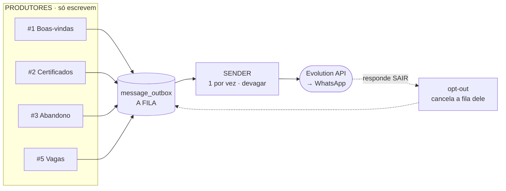
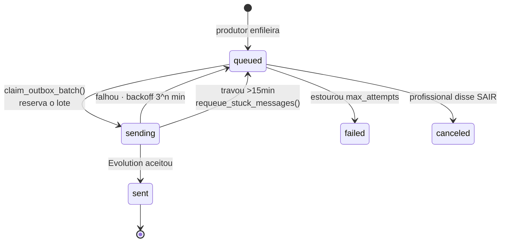

# Documentação do fluxo — Automação WhatsApp (Evolution API)

Explica **cada peça** da automação e por que ela existe. Para instalar, veja [README.md](README.md). Para a visão de arquitetura, veja [a plataforma](../plataforma-engajamento-whatsapp.md).

---

## 1. A ideia central em uma frase

> Nenhum fluxo envia mensagem. Todos apenas **escrevem numa fila**. Um único "carteiro" esvazia essa fila devagar, com ritmo humano.

Por que isso importa: se cada automação disparasse direto no WhatsApp, cinco gatilhos poderiam coincidir e mandar 300 mensagens em 2 minutos — receita certa para o número ser **bloqueado**. Com a fila, o volume é controlado num ponto só.



---

## 2. De onde vem o número do destinatário

Esta é a pergunta mais importante do fluxo: **como o sistema sabe para quem enviar?**

O número **nunca é digitado no n8n**. Ele vem sempre do Supabase, nesta cadeia:

```
profiles.phone  →  wa_normalize_phone()  →  message_outbox.phone  →  Evolution API
   (cadastro)      (limpa e põe DDI 55)        (a fila)              (envio)
```

Passo a passo:

1. **O produtor conhece só o `profile_id`** (ou a vaga/alerta). Ele chama `enqueue_message(profile_id, ...)`.
2. **A função busca o telefone no banco:**
   ```sql
   SELECT wa_normalize_phone(p.phone), coalesce(p.whatsapp_opt_out,false)
     FROM profiles p WHERE p.id = p_profile_id;
   ```
3. **Normaliza** com `wa_normalize_phone()`: remove tudo que não é dígito e, se tiver 11 dígitos ou menos, prefixa `55` (Brasil). `(21) 99999-9999` → `5521999999999` — exatamente o formato que a Evolution espera.
4. **Barreiras aqui**: se o perfil não tem telefone **ou** está em `whatsapp_opt_out`, a função retorna `NULL` e **nada é enfileirado**. O bloqueio acontece na origem.
5. **Grava na fila** junto com o texto já renderizado.
6. **O Sender só lê** `message_outbox.phone` e manda para a Evolution. Ele não consulta `profiles` — o número já veio resolvido.

> **Consequência prática:** dá para auditar exatamente quem vai receber o quê **antes** de qualquer envio, consultando a fila.
>
> ```sql
> SELECT phone, template_key, scheduled_for, left(body,80)
>   FROM message_outbox WHERE status='queued';
> ```

**No caminho de volta** (mensagem recebida), a Evolution manda `data.key.remoteJid` = `5521999999999@s.whatsapp.net`. O workflow corta no `@` e a função `wa_handle_optout()` casa esse número com `profiles` normalizando os dois lados:

```sql
WHERE wa_normalize_phone(phone) = wa_normalize_phone(p_phone)
```

Assim um telefone salvo como `(21) 99999-9999` casa com o `5521999999999` que chegou.

---

## 3. O ciclo de vida de uma mensagem



| Status | Significa |
|---|---|
| `queued` | na fila, aguardando a hora |
| `sending` | reservada por um Sender (ninguém mais pega) |
| `sent` | Evolution aceitou; guardamos o `key.id` dela |
| `failed` | esgotou as tentativas |
| `canceled` | cancelada por opt-out |
| `skipped` | descartada por regra |

---

## 4. As tabelas

### `message_outbox` — a fila
| Coluna | Para que serve |
|---|---|
| `profile_id` | de quem é a mensagem |
| **`phone`** | **o número já resolvido do Supabase e normalizado** |
| `template_key` | qual modelo foi usado |
| `vars` | as variáveis usadas (auditoria) |
| **`body`** | **o texto final, já renderizado** — dá para ler antes de enviar |
| `scheduled_for` | a partir de quando pode sair (é aqui que vive o "SLA médio") |
| `priority` | menor = mais urgente |
| `dedup_key` | **UNIQUE** — impede enviar duas vezes o mesmo evento |
| `attempts` | quantas tentativas já houve |
| `provider_msg_id` | id devolvido pela Evolution |

### `whatsapp_settings` — o painel de controle (1 linha)
Todos os limites anti-ban ficam aqui, editáveis **sem mexer no n8n**: janela comercial, fim de semana, teto por hora, rampa de aquecimento, gap por número, jitter, tamanho do lote e nº de tentativas. `enabled = false` **pausa tudo na hora**.

### `message_templates` — o texto
O copy fica no banco, com `{{variaveis}}`. Editar a mensagem é um `UPDATE`, não um deploy.

### `message_log` — auditoria
Um registro por envio, falha ou mensagem recebida.

---

## 5. As funções SQL (onde mora a inteligência)

Colocamos as regras críticas no banco, não no n8n. Motivo: **atomicidade**. O n8n pode ter duas execuções sobrepostas; o banco garante que isso não vira mensagem duplicada.

| Função | O que faz |
|---|---|
| `wa_normalize_phone(texto)` | limpa o telefone e garante o DDI 55 |
| `wa_render(modelo, vars)` | troca `{{nome}}` pelos valores |
| `wa_daily_cap()` | calcula o teto de hoje pela rampa de aquecimento |
| **`enqueue_message(...)`** | **busca o telefone, checa opt-out, renderiza e põe na fila** |
| **`claim_outbox_batch()`** | **reserva um lote aplicando TODAS as regras anti-ban** |
| `mark_message_sent(id, msg_id)` | marca enviada + log |
| `mark_message_failed(id, erro)` | reagenda com backoff, ou marca `failed` |
| `requeue_stuck_messages()` | destrava o que ficou em `sending` |
| `wa_handle_optout(fone)` | marca opt-out e cancela a fila daquele número |
| `is_profile_complete(user_id)` | a regra de perfil completo (inclui **certificado anexado**) |
| `enqueue_welcome / _certificate_alerts / _abandoned_onboarding / _job_matches` | os 4 produtores |

### O coração: `claim_outbox_batch()`

Roda em ordem e **para na primeira barreira**:

1. `enabled` está ligado? Senão, retorna vazio.
2. Está dentro da **janela comercial** (9h–20h no fuso configurado)?
3. É **fim de semana**? (bloqueia, salvo se `send_on_weekends`)
4. Já bati o **teto por hora**?
5. Já bati o **teto do dia** (rampa de aquecimento)?
6. Seleciona as candidatas: `queued`, com hora chegada, **sem opt-out**, e cujo número **não recebeu nada nas últimas N horas**.
7. `FOR UPDATE SKIP LOCKED` → marca `sending` e devolve.

> **Por que `FOR UPDATE SKIP LOCKED`:** se dois Senders rodarem juntos, o segundo *pula* as linhas que o primeiro travou, em vez de esperar ou pegar as mesmas. Sem isso, execuções sobrepostas do n8n gerariam mensagens duplicadas — o erro mais comum nesse tipo de automação.

---

## 6. As 6 raias do workflow

Um único workflow com 6 triggers. **Quando um dispara, só o ramo dele roda.**

### 🚚 Raia A — SENDER (o único que envia)

| Nó | O que faz |
|---|---|
| `A cada 2 min` | acorda o carteiro |
| `Config Evolution` | URL base, instância e apikey |
| `Destravar presas` | devolve à fila o que travou em `sending` há +15 min |
| `Reservar lote` | chama `claim_outbox_batch()` — **aqui aplicam-se todas as regras**. Sem mensagens elegíveis, retorna 0 linhas e o fluxo acaba |
| `Loop 1 por vez` | processa **uma** mensagem por iteração |
| `Enviar via Evolution` | `POST /message/sendText/{instancia}`, header `apikey`, body `{ number, text }` |
| `Marcar enviada` / `Marcar falha` | grava o resultado (a saída de erro do HTTP não derruba o workflow) |
| `Jitter humano` | espera **8 a 35s aleatórios** e volta ao loop |

O envio propriamente dito:

```jsonc
POST https://sua-evolution.com/message/sendText/hunters
Headers: { "apikey": "..." }
Body:    { "number": "5521999999999",   // ← message_outbox.phone (veio do Supabase)
           "text":   "Olá, João! ..." } // ← message_outbox.body (já renderizado)
```

### 👋 Raia B — Boas-vindas (#1)
`Webhook signup` → `Tem profile_id?` → `enqueue_welcome()`.
A função agenda para **10 a 40 min depois** (aleatório) — o "SLA médio" que você pediu: não é instantâneo, parece humano e espalha a carga. Dedup por `profile_id`, então reenvio do webhook não duplica.

### 📜 Raia C — Certificados (#2)
`Diário 08:12` → chama a edge function **`check-certificate-alerts` que já existe** (popula `certificate_alerts` com `expiring_30/15/7/expired`) → `enqueue_certificate_alerts()` pega os que têm `notified_at IS NULL`, enfileira e marca como notificados.
Prioridade por gravidade: **vencido (10) > 7d (20) > 15d (30) > 30d (40)**. Se a edge function falhar, o fluxo segue com os alertas existentes.

### ⏳ Raia D — Cadastro abandonado (#3)
`De hora em hora` → `enqueue_abandoned_onboarding()`: quem **iniciou** a trilha (`onboarding_step > 0`), passou de **24h** e ainda não completou. Limites: **3 dias** entre lembretes e **máximo 5** no total. Quando o perfil fica completo, ele some da view e para de receber — sem precisar "desligar" nada.

### 🚢 Raia E — Vagas por função (#5)
`Webhook vaga ativada` → `enqueue_job_matches(job_id)`. **Filtro duro**, exatamente como definido:

```sql
lower(btrim(p.desired_function)) = lower(btrim(j.function_name))  -- mesma função
AND is_profile_complete(p.user_id)                                -- perfil completo
AND NOT p.whatsapp_opt_out                                        -- consentimento
```

Cada match vira uma linha na fila **com o telefone daquele perfil**, agendada aleatoriamente em até 8h para espalhar. `dedup_key = 'job:<job>:<profile>'` garante que ninguém receba a mesma vaga duas vezes.

### 🛑 Raia F — Opt-out (LGPD)
`Webhook MESSAGES_UPSERT` → extrai telefone e texto → se **não** é `fromMe` **e** contém "SAIR" → `wa_handle_optout()`: marca `whatsapp_opt_out = true` e **cancela** tudo que estava na fila para aquele número.

Todos os templates trazem o rodapé *"Se não quiser mais receber mensagens, responda SAIR"*. Se a mensagem não for "SAIR", cai num `NoOp` — **é exatamente aí que o chatbot IA da Fase 2 vai entrar**.

---

## 7. As 7 defesas contra bloqueio

| # | Defesa | Onde |
|---|---|---|
| 1 | **Fila única** — nenhum produtor envia direto | arquitetura |
| 2 | **Warm-up**: começa em 20/dia e cresce 20%/dia | `wa_daily_cap()` |
| 3 | **Teto por hora** | `claim_outbox_batch()` |
| 4 | **Janela comercial** + bloqueio de fim de semana | `claim_outbox_batch()` |
| 5 | **Gap por número**: nunca 2 msgs à mesma pessoa em ~20h | `claim_outbox_batch()` |
| 6 | **Jitter 8–35s** e lote de 1 em 1 | nó `Jitter humano` |
| 7 | **Opt-out respeitado** no enfileiramento *e* no envio | `enqueue_message` + `claim_outbox_batch` |

A #2 é a mais importante num número novo. Não pule o aquecimento.

---

## 8. Como testar com segurança

```sql
-- 1. Desliga o envio; os produtores continuam enfileirando
UPDATE whatsapp_settings SET enabled = false;
```

Dispare os gatilhos (ou espere) e **inspecione o que sairia**:

```sql
SELECT phone, template_key, scheduled_for, priority, body
  FROM message_outbox WHERE status = 'queued'
 ORDER BY priority, scheduled_for;
```

Confira: o **número está certo e com DDI**? O **texto está bom**? A **hora faz sentido**?

```sql
-- 2. Teste com você mesmo antes de soltar para a base
DELETE FROM message_outbox WHERE status='queued' AND phone <> '55SEUNUMERO';
UPDATE whatsapp_settings SET enabled = true, warmup_initial_daily = 5;
```

Se nada sair, cheque nesta ordem: `enabled`? dentro da janela? fim de semana? teto batido? gap de 20h? opt-out? — são exatamente as barreiras da seção 5.

---

## 9. Diagnóstico rápido

| Sintoma | Causa provável |
|---|---|
| Fila cheia, nada sai | fora da janela / fim de semana / teto batido / `enabled=false` |
| Mensagens presas em `sending` | n8n caiu; o nó `Destravar presas` resolve no próximo ciclo |
| `failed` com erro de conexão | instância da Evolution desconectada — reconecte o QR Code |
| Perfil não recebe nada | sem telefone, ou `whatsapp_opt_out = true`, ou recebeu algo nas últimas 20h |
| Vaga não disparou para ninguém | perfis não têm `desired_function` idêntica **ou** não estão completos |
| Mensagem duplicada | `dedup_key` não foi informado no produtor |
