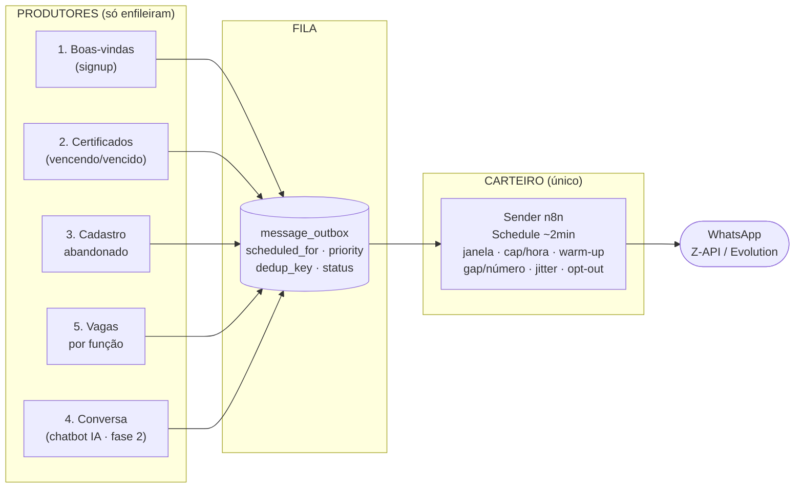
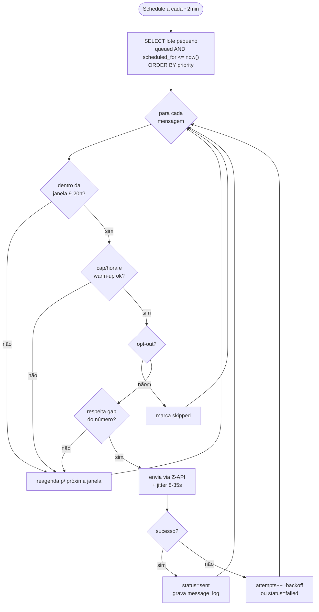
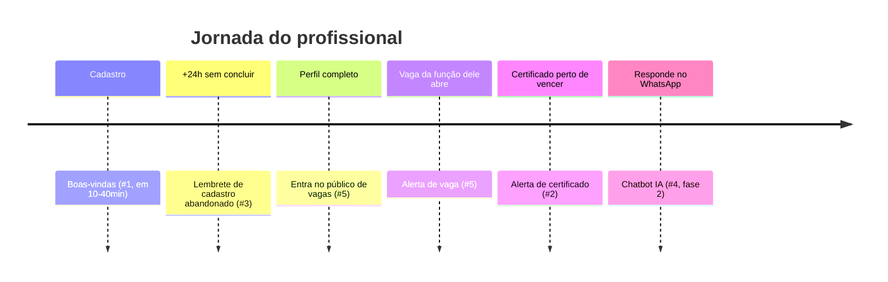
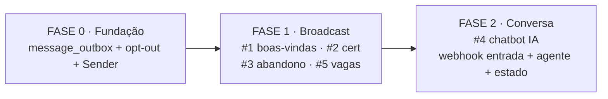

# Plataforma de Engajamento via WhatsApp

> **Status:** desenho fechado — ainda não construído.
> **Stack:** n8n + Z-API/Evolution + Supabase.
> **Data:** 2026-07-22.

Automação de comunicação com os profissionais cadastrados. Cobre boas-vindas, monitoramento de certificados, resgate de cadastros abandonados, divulgação de vagas por função e (fase 2) um chatbot que conversa sobre o perfil.

---

## 1. Princípio central: uma fila, um "carteiro"

O erro clássico — e o que faz o WhatsApp **bloquear o número** — é cada fluxo disparar direto. Aqui, **todos os fluxos apenas enfileiram** mensagens numa tabela `message_outbox`. Um **único workflow n8n ("Sender")** drena essa fila devagar, com cara de humano.

Isso é o que dá **robustez** e **dribla o bloqueio**.



---

## 2. O Sender — regras anti-bloqueio (o coração)

A cada ciclo (~2 min) o Sender pega um **lote pequeno** de mensagens `status='queued' AND scheduled_for <= now()`, ordenado por `priority`, e para cada uma aplica:

| Regra | O quê | Por quê |
|---|---|---|
| **Janela comercial** | só envia 9h–20h; fora disso, reagenda | parecer humano |
| **Teto por hora/dia** | cap global (ex. 40/h) | não estourar limites |
| **Warm-up (rampa)** | número novo começa ~20/dia e cresce ~20%/dia | **principal antídoto ao ban** |
| **Gap por número** | nunca 2 msgs ao mesmo profissional em < X horas | não parecer spam |
| **Jitter humano** | espera aleatória 8–35s entre envios | nada de rajada uniforme |
| **Opt-out / consentimento** | pula quem tem `whatsapp_opt_out=true` | LGPD |
| **Dedup / idempotência** | `dedup_key` único impede mandar 2× o mesmo evento | não repetir vaga/alerta |
| **Retry com backoff** | falhou → reagenda com atraso crescente, até N tentativas | resiliência |

**Prioridade de envio:**
`cert. vencida` > `cadastro abandonado` > `vaga` > `boas-vindas` > `conversa (fase 2)`



---

## 3. Os 5 fluxos (produtores)

| # | Fluxo | Fase | Gatilho → como enfileira | Agendamento |
|---|---|---|---|---|
| 1 | **Boas-vindas** | 1 | signup (trigger no `profiles` INSERT → `notify-webhook`) → 1 msg na outbox | `scheduled_for = now + 10–40min` aleatório (SLA médio, espalha carga) |
| 2 | **Certificados** | 1 | schedule diário → roda `check-certificate-alerts` (**já existe**) → lê `certificate_alerts WHERE notified_at IS NULL` → enfileira → seta `notified_at` | manhã, dentro da janela |
| 3 | **Cadastro abandonado** | 1 | schedule horário → `v_incomplete_candidates WHERE onboarding_step>0 AND created_at < now-24h AND sem lembrete` → enfileira **com link de convite/token** | 24h após início, depois cadência |
| 5 | **Vagas por função** | 1 | vaga ativada (ou schedule) → `profiles WHERE desired_function = job.function_name AND profile_complete=true AND NOT opt_out` → 1/profissional, `dedup_key=(profile,job)` | espalhado ao longo do dia |
| 4 | **Conversa sobre o perfil** | **2** | webhook de **entrada** do Z-API → agente IA com contexto do perfil (`ai.gateway.lovable.dev`) | tempo real, dentro da janela de 24h do WhatsApp |

### Decisões travadas
- **#4 (conversa):** modelo **híbrido** — começa proativo simples na Fase 1; o **chatbot IA 2-way fica para a Fase 2**, depois que a fila estiver estável.
- **#5 (vagas):** público é **filtro duro** — `desired_function = function_name` **E** `profile_complete = true` **E** não opt-out. Mais qualificado, menos volume, melhor contra ban.



---

## 4. O que reaproveita (não recria)

| Necessidade | Já existe na plataforma |
|---|---|
| Lógica de vencimento de certificado (#2) | `check-certificate-alerts` + tabela `certificate_alerts` (`alert_type`: expiring_30/15/7/expired, `notified_at`) |
| Ponte app → n8n (#1, #5) | `system_webhooks` + edge function `notify-webhook` |
| Match / ranqueamento (#5) | `job_match_scores` + `calculate-match-score` (opcional; a regra base é filtro por função) |
| Convite/link único (#3) | tabela de convites + token + `v_incomplete_candidates` (desenho anterior) |
| Matching de função | `profiles.desired_function` (texto único) × `jobs.function_name` (catálogo em `job_functions`) |

---

## 5. Aditivos no banco (mínimos)

```text
message_outbox        -- a fila
  id, profile_id, phone, template_key, vars(jsonb),
  scheduled_for, priority, status,           -- queued|sending|sent|failed|skipped
  attempts, dedup_key (UNIQUE), provider_msg_id, sent_at

message_log           -- auditoria de cada envio/erro

profiles.whatsapp_opt_out   boolean          -- LGPD
profiles.whatsapp_consent_at timestamptz

-- reutilizados:
certificate_alerts.notified_at
onboarding_invites (token ~30d)
v_incomplete_candidates (view de completude)
```

---

## 6. Riscos & LGPD

- **Anti-ban** depende do trio **warm-up + jitter + cap**. Comece conservador (número aquecendo).
- **Opt-out obrigatório**: rodapé *"responda SAIR para não receber mais"* + handler de entrada que seta `whatsapp_opt_out`. **Esse handler já precisa existir na Fase 1**, mesmo sem o chatbot.
- **Janela de 24h do WhatsApp**: Z-API é não-oficial (sem template HSM), então mensagens proativas funcionam — mas é o que mais expõe a ban. Daí a fila lenta.
- **Consentimento**: registrar `whatsapp_consent_at` no cadastro.

---

## 7. Ordem de construção



1. **Fase 0 — Fundação.** `message_outbox` + `whatsapp_opt_out` + Sender n8n. **Sem isso, nada é seguro.**
2. **Fase 1 — Broadcast proativo.** Produtores #1, #2, #3, #5.
3. **Fase 2 — Conversa.** #4 chatbot IA (webhook de entrada Z-API + agente + estado da conversa).

---

## 8. Deliverables pendentes (quando for construir)

- **Migração SQL:** `message_outbox`, `message_log`, colunas de opt-out/consent; `is_profile_complete()` + `v_incomplete_candidates`; `onboarding_invites`.
- **Sender (n8n):** workflow único com todas as regras da seção 2.
- **Produtores (n8n):** 1 trigger/schedule por fluxo, cada um só enfileirando.
- **Edge functions:** `redeem-invite` (valida token → sessão → `/cadastro`); handler de **entrada** do Z-API (mínimo: SAIR/opt-out na Fase 1).
- **Front:** rota `/convite/:token`.
- **Config:** credenciais Z-API + base URL no n8n; entradas em `system_webhooks`.

---

## 9. Guia para montar no Miro (fluxograma visual)

Objetivo: um quadro onde as **peças se encaixam** da esquerda (gatilhos) para a direita (WhatsApp), com uma volta de feedback embaixo (respostas do profissional).

### 9.1 Dois caminhos

- **Rápido:** o Miro cria diagramas a partir de código Mermaid (app *Mermaid* / *Miro Assist* → "create diagram from text"). Cole cada bloco ```mermaid``` deste arquivo e ele gera o desenho. Bom para começar.
- **Manual (recomendado para o visual "encaixando"):** monte com *sticky notes* + *shapes* + *connectors* seguindo o mapa abaixo. Dá mais controle do encaixe.

### 9.2 Legenda de cores (padronize antes de começar)

| Cor | Tipo de bloco | Forma sugerida |
|---|---|---|
| 🟩 Verde | **Gatilho / evento** (signup, schedule, vaga ativada, resposta recebida) | círculo / pílula |
| 🟦 Azul | **Dado / tabela** (message_outbox, certificate_alerts, profiles…) | cilindro (banco) |
| 🟨 Amarelo | **Decisão** (janela? opt-out? gap? função igual?) | losango |
| 🟪 Roxo | **Ação** (enfileirar, enviar, setar notified_at) | retângulo |
| ⬜ Cinza | **Sistema externo** (Z-API/WhatsApp, IA gateway) | retângulo pontilhado |
| 🟧 Laranja | **Fase 2 / futuro** (chatbot IA) | qualquer, com borda tracejada |

### 9.3 Raias (crie 5 *Frames* lado a lado, da esquerda p/ a direita)

```
┌────────────┬────────────┬────────────┬────────────┬────────────┐
│ A. GATILHOS│  B. FILA   │ C. SENDER  │ D. CANAL   │ E. FEEDBACK │
│ (produtores│(message_   │ (regras    │ (WhatsApp) │ (respostas /│
│  #1..#5)   │  outbox)   │  anti-ban) │            │  opt-out)   │
└────────────┴────────────┴────────────┴────────────┴────────────┘
```

### 9.4 O que colocar em cada raia (inventário de cards)

**Raia A — Gatilhos (empilhe 5 cards verdes, um p/ cada fluxo):**
- `#1 Signup` 🟩 → nota: "trigger profiles INSERT → notify-webhook"
- `#2 Schedule diário` 🟩 → "roda check-certificate-alerts"
- `#3 Schedule horário` 🟩 → "view v_incomplete_candidates (>24h, incompleto)"
- `#5 Vaga ativada` 🟩 → "job.is_active = true"
- `#4 Resposta recebida` 🟧 (fase 2) → "webhook de entrada Z-API"

**Cada gatilho tem 1 ação roxa "Enfileirar" antes de chegar na fila.** Ex.:
- #1 → 🟪 `Enfileirar boas-vindas` (nota: `scheduled_for = now + 10–40min`)
- #2 → 🟦 `certificate_alerts` (lê `notified_at IS NULL`) → 🟪 `Enfileirar alerta` → 🟪 `setar notified_at`
- #3 → 🟪 `Gerar token/convite` → 🟪 `Enfileirar lembrete`
- #5 → 🟨 `desired_function = function_name AND profile_complete?` → 🟪 `Enfileirar vaga` (dedup profile+job)

**Raia B — Fila:**
- 🟦 `message_outbox` (cilindro central grande) → nota com os campos: `scheduled_for · priority · dedup_key · status`

**Raia C — Sender (a sequência de losangos amarelos — copie do fluxograma da seção 2):**
`🟩 Schedule ~2min` → 🟪 `Pegar lote (queued & due, por priority)` → 🟨 `Janela 9–20h?` → 🟨 `Cap/hora + warm-up?` → 🟨 `Opt-out?` → 🟨 `Gap do número?` → 🟪 `Enviar + jitter 8–35s` → 🟨 `Sucesso?`
- saídas dos "não": seta de volta para 🟪 `Reagendar` (loop pra fila)
- `Sucesso? não` → 🟪 `attempts++ / backoff / failed`
- `Sucesso? sim` → 🟪 `status=sent + message_log`

**Raia D — Canal:**
- ⬜ `WhatsApp (Z-API)` → recebe do Sender.

**Raia E — Feedback (a volta de baixo):**
- 🟩 `Profissional responde` → 🟨 `Escreveu "SAIR"?`
  - sim → 🟪 `setar whatsapp_opt_out=true` → seta que volta e "corta" o Sender (mostra que opt-out bloqueia envios)
  - não → 🟧 `Chatbot IA (fase 2)` → ⬜ `ai.gateway.lovable.dev` → volta pro WhatsApp

### 9.5 Conexões principais (setas)

| De | Para | Rótulo |
|---|---|---|
| Cada gatilho (A) | sua ação "Enfileirar" | — |
| Toda ação "Enfileirar" | `message_outbox` (B) | "insert" |
| `message_outbox` | Sender "Pegar lote" (C) | "queued & due" |
| Losangos "não" (janela/cap/gap) | `Reagendar` → `message_outbox` | "reagenda" |
| `Opt-out? sim` | `skipped` | — |
| Sender "Enviar" | `WhatsApp` (D) | — |
| `WhatsApp` | `Profissional responde` (E) | — |
| `SAIR? sim` → `opt-out` | corta o Sender (seta tracejada até o losango Opt-out) | "bloqueia" |

### 9.6 Ordem de montagem (para as peças "se encaixarem")

1. Crie as **5 raias (Frames)** e a **legenda de cores** num canto.
2. Coloque o **`message_outbox` no centro** (raia B) — é o ponto de encontro de tudo.
3. Monte a **raia C (Sender)** como uma esteira de losangos — é o miolo; deixe espaço vertical.
4. Volte à **raia A** e ligue cada gatilho → "Enfileirar" → `message_outbox`.
5. Ligue `message_outbox` → Sender → `WhatsApp` (raia D).
6. Desenhe a **volta de feedback (raia E)** por baixo, terminando com a seta tracejada de opt-out cortando o Sender.
7. Marque os cards **🟧 laranja/tracejado** (#4 e chatbot) como **Fase 2** — visualmente separados.

### 9.7 Dicas de Miro

- Use **Frames** (não só retângulos) para as raias — permite navegar/apresentar por partes.
- **Tags** nos cards: `Fase 1` / `Fase 2` e `#1…#5` para filtrar depois.
- **Trave** (lock) a legenda e os frames pra não arrastar sem querer.
- **Connectors com rótulo** nos "sim/não" dos losangos — é o que deixa o fluxo legível.
- Cores exatamente como na legenda 9.2: a leitura fica imediata (verde entra, roxo faz, amarelo decide, azul guarda, cinza é externo).

